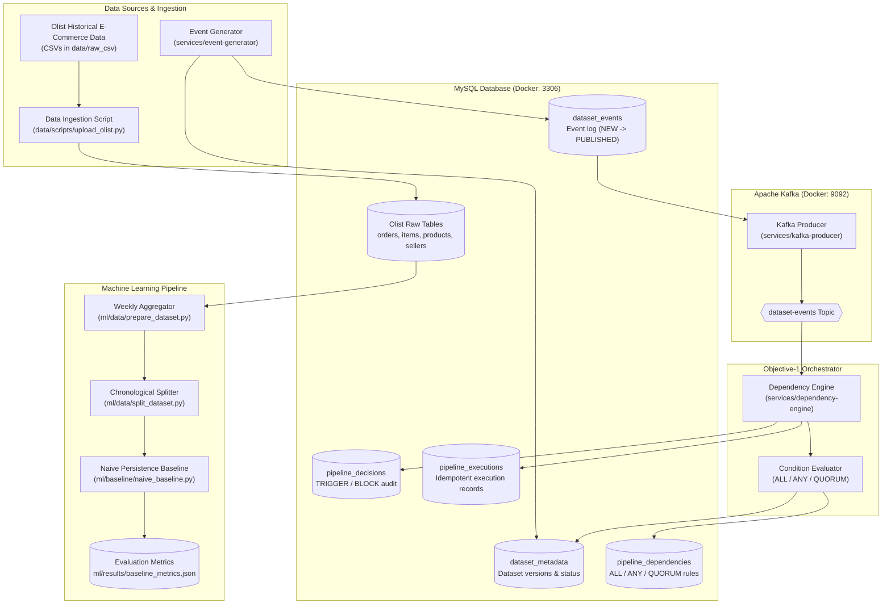

# SupplySense AI

SupplySense AI is an intelligent, event-driven data and machine learning orchestration platform that coordinates downstream demand forecasting pipelines based on upstream dataset availability, version synchronization, and data freshness across supply chain networks.

---

## Architecture Overview



---

## Current Verified State (Review-2)

| Component | Status | Verification Summary |
|---|---|---|
| **Objective-1 Orchestration** | Verified | Complete event-driven lifecycle: Event Generation → Kafka → Dependency Evaluation (`ALL`, `ANY`, `QUORUM`) → Decision Audit (`TRIGGER`/`BLOCK`) → Execution Tracking |
| **Idempotency** | Verified | Enforces unique `(pipeline_name, triggering_event_id)` preventing duplicate downstream pipeline runs |
| **Dataset Ingestion & ETL** | Verified | Olist e-commerce dataset schema mapping and chunked bulk ingestion into MySQL |
| **Forecasting Formulation** | Verified | Weekly product category item aggregation (`forecasting_dataset.csv`) |
| **Dataset Splitting** | Verified | Strict chronological split: 70% Train (2,795 rows), 15% Validation (807 rows), 15% Test (770 rows) without lookahead leakage |
| **Baseline Benchmark** | Verified | One-step-ahead persistence model ($\hat{y}_t = y_{t-1}$): Validation $R^2 = 0.8992$, Test $R^2 = 0.8351$ |
| **Automated Tests** | 33/33 Passing | 28 Unit tests + 5 Integration tests executing in < 0.5s |

---

## Documentation Quick Links

| Document | Purpose |
|---|---|
| **[Developer Runbook](file:///docs/RUNBOOK.md)** | Comprehensive 18-section guide to prerequisites, environment, execution, demo flow, and troubleshooting |
| **[Quick Start Guide](file:///docs/QUICKSTART.md)** | Minimal sequential commands for launching infrastructure, services, and running the pipeline |
| **[Command Reference](file:///docs/COMMANDS.md)** | Full list of verified CLI, Docker, and MySQL verification commands |
| **[System Architecture](file:///docs/architecture.md)** | High-level data flow and architecture specification |
| **[Database Guide](file:///database/README.md)** | Schema migrations (001–006), table definitions, and volume reset instructions |
| **[Machine Learning Guide](file:///ml/README.md)** | Forecasting problem formulation, data preparation, splitting, and baseline benchmark |
| **[Review-2 Documentation Pack](file:///docs/review-2/README.md)** | Presentation outlines, viva Q&A, demo checklists, and metric summaries |

---

## Fast-Track Setup

```bash
# 1. Setup virtual environment & dependencies
python -m venv .venv
.\.venv\Scripts\Activate.ps1       # On Linux/macOS: source .venv/bin/activate
pip install -r requirements.txt

# 2. Configure environment
Copy-Item .env.example .env       # On Linux/macOS: cp .env.example .env

# 3. Start MySQL and Kafka infrastructure
docker compose up -d

# 4. Verify the test suite
python -m unittest discover -s tests
```

---

## Project Structure Overview

```
capstone/
├── common/             # PyMySQL connection utilities
├── config/             # Settings and environment loader
├── data/
│   ├── processed/      # Aggregated dataset, chronological splits, and prediction outputs
│   ├── raw_csv/        # Raw historical Olist CSVs
│   └── scripts/        # Olist database ingestion script
├── database/           # 6 ordered SQL migrations & database README
├── docs/               # Runbook, Quickstart, Command reference, and Review-2 docs
├── ml/
│   ├── baseline/       # Persistence baseline forecasting model
│   ├── data/           # Weekly demand aggregation and temporal splitting
│   └── results/        # Baseline benchmark metrics (JSON & CSV)
├── services/
│   ├── dependency-engine/  # Kafka consumer & dependency evaluator daemon
│   ├── event-generator/    # Interactive dataset update simulator
│   └── kafka-producer/     # MySQL-to-Kafka publisher
├── tests/
│   ├── integration/    # DB connection & Objective-1 flow tests
│   └── unit/           # Config, evaluator, split, and baseline unit tests
├── docker-compose.yml  # MySQL 8.0 & Apache Kafka 4.3.1 definitions
└── requirements.txt    # Python package dependencies
```

---

## Current Scope & Limitations

- **Source Data:** Olist is a static historical e-commerce dataset (2016–2018). It is not an active real-time production stream.
- **Event Simulation:** The Event Generator simulates dataset change events to test orchestration rules and Kafka pipeline triggers.
- **Baseline Model:** The naive persistence model establishes the initial benchmark floor; advanced models (e.g., XGBoost, LightGBM), workflow schedulers (e.g., Airflow), and UI dashboards are planned for subsequent development phases.
