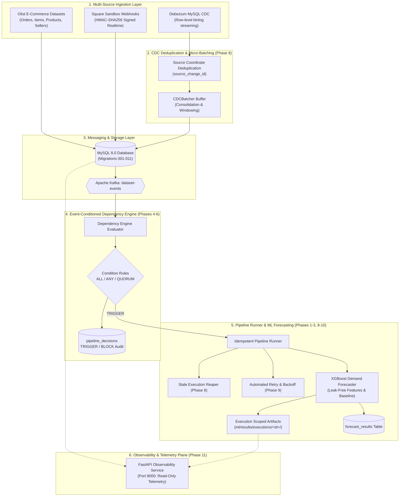

# SupplySense AI

**SupplySense AI** is an intelligent, event-driven data orchestration and machine learning platform that coordinates downstream demand forecasting pipelines based on upstream dataset availability, version synchronization, and data freshness across supply chain networks.

> **Core Philosophy**: *"Don't run downstream data pipelines simply because a cron schedule elapsed; run them when all required data dependencies are actually synchronized, validated, and ready."*

---

## Master Architecture


```mermaid
flowchart TD
    subgraph DataSources["1. Multi-Source Ingestion Layer"]
        Olist["Olist E-Commerce Datasets<br/>(Orders, Items, Products, Sellers)"]
        Square["Square Sandbox Webhooks<br/>(HMAC-SHA256 Signed Realtime)"]
        CDC["Debezium MySQL CDC<br/>(Row-level binlog streaming)"]
    end

    subgraph ResilientCDC["2. CDC Deduplication & Micro-Batching (Phase 8)"]
        Dedup["Source Coordinate Deduplication<br/>(source_change_id)"]
        Batcher["CDCBatcher Buffer<br/>(Consolidation & Windowing)"]
    end

    subgraph EventTransport["3. Messaging & Storage Layer"]
        Kafka{{"Apache Kafka: dataset-events"}}
        MySQL[("MySQL 8.0 Database<br/>(Migrations 001-011)")]
    end

    subgraph Orchestration["4. Event-Conditioned Dependency Engine (Phases 4-6)"]
        Engine["Dependency Engine Evaluator"]
        Rules{"Condition Rules<br/>ALL / ANY / QUORUM"}
        Decisions[("pipeline_decisions<br/>TRIGGER / BLOCK Audit")]
    end

    subgraph ExecutionPlane["5. Pipeline Runner & ML Forecasting (Phases 1-3, 9-10)"]
        Runner["Idempotent Pipeline Runner"]
        Reaper["Stale Execution Reaper (Phase 8)"]
        Retry["Automated Retry & Backoff (Phase 9)"]
        ML["XGBoost Demand Forecaster<br/>(Leak-Free Features & Baseline)"]
        ScopedArtifacts["Execution Scoped Artifacts<br/>(ml/results/executions/&lt;id&gt;/)"]
        ForecastDB[("forecast_results Table")]
    end

    subgraph ObservabilityLayer["6. Observability & Telemetry Plane (Phase 11)"]
        ObsAPI["FastAPI Observability Service<br/>(Port 8000: Read-Only Telemetry)"]
    end

    Olist --> MySQL
    Square --> MySQL
    CDC --> Dedup --> Batcher --> MySQL
    MySQL --> Kafka
    Kafka --> Engine
    Engine --> Rules
    Rules --> Decisions
    Rules -- TRIGGER --> Runner
    Runner --> Reaper
    Runner --> Retry
    Runner --> ML
    ML --> ScopedArtifacts
    ML --> ForecastDB
    MySQL -.-> ObsAPI
    ScopedArtifacts -.-> ObsAPI
```

---

## Phase Matrix & Project Evolution

| Phase | Core Capability | Key Technical Innovations |
|---|---|---|
| **Phase 1** | Forecasting Problem Formulation | Weekly product category aggregation (`forecasting_dataset.csv`), 70/15/15 chronological split without lookahead leakage. |
| **Phase 2** | Machine Learning Pipeline | Leak-free lag, rolling, calendar, and categorical target features; XGBoost Regressor with validation early stopping. |
| **Phase 3** | Benchmark Evaluation | One-step-ahead rolling naive persistence baseline ($\hat{y}_t = y_{t-1}$) and automated comparison report. |
| **Phase 4** | Dependency Engine & Runner | Event-conditioned `ALL` / `ANY` / `QUORUM` evaluations, `pipeline_decisions` audit, and idempotent pipeline execution. |
| **Phase 5** | Real-Time Webhook Ingestion | Square sandbox webhook receiver with HMAC-SHA256 signature verification and inventory normalization. |
| **Phase 6** | Forecast Persistence | Downstream MySQL persistence (`forecast_results`), foreign key execution mapping, and bulk upsert repository. |
| **Phase 7** | Debezium MySQL CDC | Low-latency binlog change capture via Debezium Connect, Kafka streaming, and downstream pipeline triggering. |
| **Phase 8** | Resilient CDC Processing | `source_change_id` deduplication, `CDCBatcher` micro-batching (200 rows → 1 event), and stale execution reaper. |
| **Phase 9** | Automated Pipeline Retry | Exponential backoff retry policy, transient error classification (`TRANSIENT_DB`, `TRANSIENT_NETWORK`), and atomic claiming. |
| **Phase 10** | Execution Artifact Isolation | Collision-free scoped directories (`ml/results/executions/<execution_id>/`), atomic writes, and metadata auditability. |
| **Phase 11** | Observability & Telemetry API | Read-only FastAPI monitoring service (`services/observability`) with SQL aggregations, rate metrics, and execution detail. |
| **Phase 12** | Master E2E Capstone Integration | Master demonstration script (`demo_e2e_capstone.py`), integration verification, and complete capstone readiness. |

---

## Fast-Track Quickstart

### 1. Environment & Dependencies Setup
```bash
# Clone and enter directory
cd capstone

# Create and activate Python virtual environment
python -m venv .venv
.\.venv\Scripts\Activate.ps1       # On Linux/macOS: source .venv/bin/activate

# Install requirements
pip install -r requirements.txt

# Configure environment variables
Copy-Item .env.example .env       # On Linux/macOS: cp .env.example .env
```

### 2. Start Infrastructure
```bash
docker compose up -d
```

### 3. Run the Master End-to-End Capstone Demo
```bash
python scripts/demo_e2e_capstone.py
```

### 4. Run the Full Test Suite
```bash
python -m unittest discover -s tests -p "test_*.py"
```

---

## Documentation Navigation

- **[Phase 12 Capstone Readiness & Integration Report](file:///docs/phase-12/README.md)**
- **[Phase 11 Observability & Monitoring Service](file:///docs/phase-11/README.md)**
- **[Phase 10 Execution Artifact Isolation](file:///docs/phase-10/README.md)**
- **[Phase 9 Automated Pipeline Retry & Recovery](file:///docs/phase-9/README.md)**
- **[Phase 8 CDC Resilience & Micro-Batching](file:///docs/phase-8/README.md)**
- **[Phase 7 Debezium CDC Integration](file:///docs/phase-7/README.md)**
- **[Phase 6 Forecast Persistence Guide](file:///docs/phase-6/README.md)**
- **[Phase 5 Square Webhooks Integration](file:///docs/phase-5/README.md)**
- **[Phase 4 Pipeline Execution Guide](file:///docs/phase-4/README.md)**
- **[System Architecture Reference](file:///docs/architecture.md)**
- **[Developer Runbook](file:///docs/RUNBOOK.md)**
