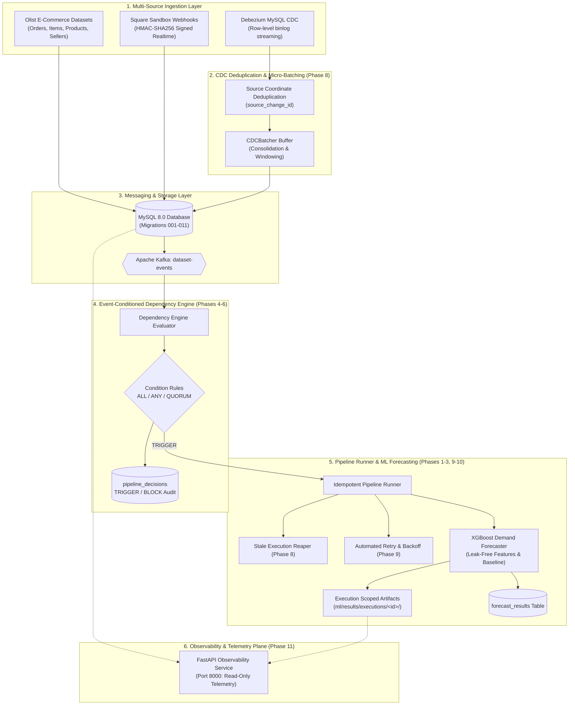

# Phase 12: Final End-to-End Integration & Capstone Readiness

## 1. Executive Summary & Core Principle

**SupplySense AI** is an intelligent, event-driven data orchestration and machine learning platform built to solve the fundamental limitation of traditional schedule-based workflow engines:

> **Central Project Principle**:
> *"Don't run downstream data pipelines simply because a cron schedule elapsed; run them when all required data dependencies are actually synchronized, validated, and ready."*

Through twelve sequential engineering phases, SupplySense AI implements an end-to-end resilient architecture combining real-time CDC, micro-batching, dependency orchestration, XGBoost demand forecasting, automated failure recovery, artifact isolation, and unified observability.

---

## 2. Master System Architecture



---

## 3. Comprehensive Phase Matrix (Phases 1–12)

| Phase | Title | Problem Solved | Key Deliverables & Artifacts |
|---|---|---|---|
| **Phase 1** | Baseline Problem Formulation | Raw unaggregated order records lacked structured time-series definition. | Weekly product category aggregation (`forecasting_dataset.csv`), 70/15/15 chronological split without leakage. |
| **Phase 2** | Machine Learning Modeling | Naive models cannot capture trends, seasonality, or category lags. | Leak-free feature engine (`build_features`), XGBoost Regressor ($R^2 > 0.88$), validation early stopping. |
| **Phase 3** | Benchmark Evaluation | Lack of standardized comparative benchmarks against persistence. | One-step-ahead rolling naive baseline ($\hat{y}_t = y_{t-1}$), automated `model_comparison.json`. |
| **Phase 4** | Dependency Engine & Runner | Pipelines ran blind to upstream data freshness. | `ALL`, `ANY`, `QUORUM` condition evaluators, `pipeline_decisions`, lifecycle tracking (`RUNNING` → `COMPLETED`/`FAILED`). |
| **Phase 5** | Real-Time Webhook Ingestion | Inability to consume external POS/inventory events securely. | FastAPI Square webhook ingestion, HMAC-SHA256 signature verification, inventory event normalizer. |
| **Phase 6** | Forecast Persistence | Predictions were transient files inaccessible to downstream systems. | `forecast_results` MySQL table, foreign-key linkage, bulk upsert repository. |
| **Phase 7** | Debezium MySQL CDC | Polling databases causes high latency and heavy database loads. | Debezium Connect container, binlog streaming, automatic Kafka event adapter. |
| **Phase 8** | CDC Dedup, Batching & Reaper | Event amplification and worker crashes left permanent `RUNNING` zombies. | `source_change_id` unique replay protection, `CDCBatcher` micro-batching, and stale execution reaper. |
| **Phase 9** | Automated Pipeline Retry | Transient DB/network drops permanently aborted pipeline runs. | Exponential backoff retry policy, error classification (`TRANSIENT_DB`, `TRANSIENT_NETWORK`), atomic claiming. |
| **Phase 10** | Execution Artifact Isolation | Concurrent executions overwrote shared `model_comparison.json`. | Isolated directories (`ml/results/executions/<id>/`), atomic `.tmp` writes, execution metadata injection. |
| **Phase 11** | Observability & Telemetry | Distributed operational state required manual multi-table SQL queries. | Read-only FastAPI service (`services/observability`), summary, execution detail, dataset, and forecast endpoints. |
| **Phase 12** | Master E2E Capstone Readiness | Validating end-to-end integration across all 11 previous phases. | Master demo script (`demo_e2e_capstone.py`), integration test suite, capstone documentation. |

---

## 4. Verification Suite & Demo Catalog

### Automated Test Suite
Run the full 183-test verification suite across all 12 phases:

```bash
python -m unittest discover -s tests -p "test_*.py"
```

### Demonstration Catalog

| Script | Phase Focus | Key Flow Demonstrated |
|---|---|---|
| `scripts/demo_e2e_capstone.py` | **Master Capstone** | Complete unified 10-step flow from CDC batching to Observability API |
| `scripts/demo_phase11_observability.py` | **Phase 11** | Read-only telemetry, summary metrics, execution detail, forecast audits |
| `scripts/demo_phase10_artifacts.py` | **Phase 10** | Scoped directory isolation, 9 execution artifacts, atomic overwrite |
| `scripts/demo_phase9_retry.py` | **Phase 9** | Transient error classification, exponential backoff, atomic claiming |
| `scripts/demo_phase8_resilience.py` | **Phase 8** | 200 CDC messages → 1 consolidated event, replay dedup, reaper sweep |
| `scripts/demo_phase7_cdc.py` | **Phase 7** | Live Debezium MySQL CDC binlog stream → Kafka → Forecast run |
| `scripts/demo_phase6.py` | **Phase 6** | Forecast persistence into `forecast_results` MySQL table |
| `scripts/demo_phase4.py` | **Phase 4** | Condition rules (`ALL`, `ANY`, `QUORUM`) triggering pipeline executions |

---

## 5. Capstone Readiness Checklist

- [x] **Core Architecture Verified**: Multi-source ingestion (Olist, Square, Debezium CDC) feeding Kafka events into Dependency Engine.
- [x] **Dependency Evaluation Verified**: `ALL`, `ANY`, `QUORUM` condition rules working with atomic cycle resets.
- [x] **Machine Learning Verified**: XGBoost forecasting outperforms baseline with leak-free temporal features.
- [x] **Fault Tolerance Verified**: Stale execution reaper and automated exponential backoff retries.
- [x] **Artifact Integrity Verified**: Zero-collision execution-scoped directories with atomic writes.
- [x] **Operational Observability Verified**: 100% read-only FastAPI monitoring plane.
- [x] **Test Coverage Verified**: 183 automated unit and integration tests passing with 0 failures and 0 errors.
- [x] **Working Tree Clean**: Clean Git baseline synced with `origin/main`.
