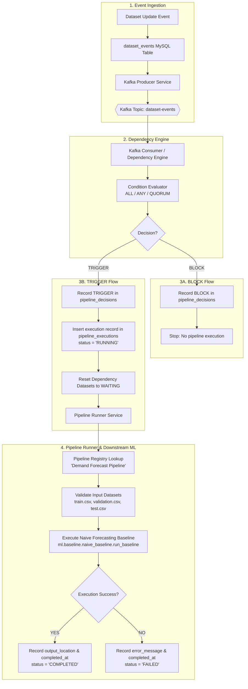

# SupplySense AI - Phase 4: Downstream Pipeline Execution

## Executive Summary
Phase 4 connects the Dependency Engine's evaluation decisions to real, downstream Python ML execution workloads. When dataset readiness satisfies configured pipeline dependency constraints (`ALL`, `ANY`, `QUORUM`), the Dependency Engine produces a `TRIGGER` decision and delegates execution to the **Pipeline Runner Service**.

The pipeline runner manages the full execution lifecycle (`RUNNING` → `COMPLETED` / `FAILED`), invokes the registered demand forecasting baseline workload, captures evaluation metrics and artifact locations in MySQL, and strictly guarantees execution idempotency.

---

## Architecture & Data Flow



---

## Pipeline Execution Lifecycle

```
                 +-------------------+
                 |   Dataset Event   |
                 +---------+---------+
                           |
                           v
                 +-------------------+
                 | Dependency Engine |
                 +---------+---------+
                           |
                           v
                 +-------------------+
                 | Evaluate Rules    |
                 +----+---------+----+
                      |         |
             [BLOCK]  |         |  [TRIGGER]
                      v         v
+-----------------------+     +-----------------------------+
| Record BLOCK Decision |     | Record TRIGGER Decision     |
+-----------------------+     +--------------+--------------+
| No Execution Started  |                    |
+-----------------------+                    v
                              +-----------------------------+
                              | Create Execution Record     |
                              | status: RUNNING             |
                              +--------------+--------------+
                                             |
                                             v
                              +-----------------------------+
                              | Reset Dependencies: WAITING |
                              +--------------+--------------+
                                             |
                                             v
                              +-----------------------------+
                              | Pipeline Runner Service     |
                              +--------------+--------------+
                                             |
                              +--------------+--------------+
                              |                             |
                              v                             v
                   +--------------------+        +--------------------+
                   |     COMPLETED      |        |       FAILED       |
                   +--------------------+        +--------------------+
                   | Save output path   |        | Save error message |
                   | Save completed_at  |        | Save completed_at  |
                   +--------------------+        +--------------------+
```

### State Definitions & Transitions
| State | Trigger / Condition | DB Fields Updated |
|---|---|---|
| `RUNNING` | Created immediately upon valid `TRIGGER` decision | `status = 'RUNNING'`, `started_at = NOW()` |
| `COMPLETED` | Downstream Python task finished successfully and verified output artifacts | `status = 'COMPLETED'`, `completed_at = NOW()`, `output_location = 'ml/results/baseline_metrics.json'`, `error_message = NULL` |
| `FAILED` | Pipeline handler failed, missing input files, or unhandled exception raised | `status = 'FAILED'`, `completed_at = NOW()`, `error_message = <error_details>` |

---

## Database Schema & Migrations

### Migration `008_add_execution_output_location.sql`
```sql
ALTER TABLE `pipeline_executions`
ADD COLUMN `output_location` VARCHAR(500) DEFAULT NULL AFTER `error_message`;
```

### Table: `pipeline_executions`
| Column | Type | Description |
|---|---|---|
| `execution_id` | `bigint AUTO_INCREMENT` | Primary key |
| `pipeline_name` | `varchar(100)` | Name of configured pipeline |
| `decision_id` | `bigint` | Foreign key referencing `pipeline_decisions` |
| `triggering_event_id` | `bigint` | ID of the event that satisfied dependencies |
| `status` | `varchar(30)` | Current status (`RUNNING`, `COMPLETED`, `FAILED`) |
| `started_at` | `datetime` | Timestamp when execution began |
| `completed_at` | `datetime` | Timestamp when execution completed or failed |
| `error_message` | `text` | Error details if failed |
| `output_location` | `varchar(500)` | Relative path to resulting metrics/artifacts |
| `created_at` | `datetime` | Record creation timestamp |

---

## Concurrency & Idempotency Guarantees

1. **Pre-execution Idempotency Check**:
   Before evaluating dependencies or creating records, the Dependency Engine queries:
   ```sql
   SELECT execution_id FROM pipeline_executions
   WHERE pipeline_name = %s AND triggering_event_id = %s;
   ```
   If found, the event is immediately marked `SKIPPED` without re-running the pipeline.

2. **Atomic Database Constraint**:
   The table enforces a unique compound index:
   ```sql
   UNIQUE KEY `idx_unique_pipeline_event` (`pipeline_name`, `triggering_event_id`)
   ```
   Any concurrent duplicate insert throws a `pymysql.err.IntegrityError`, caught gracefully with a database rollback.

3. **Dependency Cycle Reset Timing**:
   Dependency datasets (`Orders`, `Products`, `Sellers`) are updated to `WAITING` within the same database transaction where the `pipeline_executions` record is created, preventing stale dependency triggers.

---

## Failure Handling & Recovery

| Failure Mode | Behavior | Recovery Action |
|---|---|---|
| **Missing ML Input Datasets** | Runner catches missing `train.csv` / `validation.csv` / `test.csv`, marks status `FAILED` with explicit error message. | Run `python ml/data/prepare_dataset.py` and `python ml/data/split_dataset.py`. |
| **Model / Script Exception** | Caught by runner; execution marked `FAILED` with exception string and traceback in `error_message`. | Inspect `error_message` in MySQL, resolve underlying cause. |
| **Unknown Pipeline Name** | Runner safely marks execution `FAILED` without crashing process. | Register handler in `services/pipeline-runner/registry.py`. |
| **Process Interruption / Crash** | Executions interrupted mid-flight remain marked `RUNNING` without a `completed_at` timestamp. | Query `SELECT * FROM pipeline_executions WHERE status = 'RUNNING' AND started_at < NOW() - INTERVAL 1 HOUR;` and re-evaluate or mark `FAILED`. |
