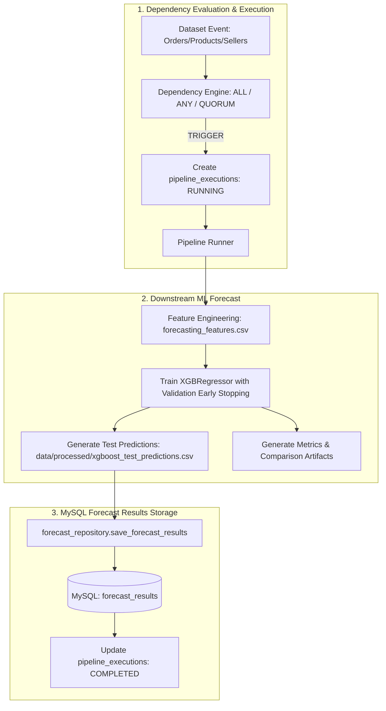

# SupplySense AI - Phase 6: Downstream Forecast Results Persistence

## Executive Summary
Phase 6 connects the downstream machine learning pipeline outputs directly into persistent relational storage within **MySQL**. When a dependency condition is met and produces a `TRIGGER` decision, the Demand Forecast Pipeline executes XGBoost forecasting and persists the out-of-sample category demand predictions into a new `forecast_results` table, uniquely linked to the parent `pipeline_executions` record by `execution_id`.

---

## Architecture & Lifecycle



---

## Database Schema (`forecast_results`)

Defined in `database/migrations/009_create_forecast_results.sql`:

```sql
CREATE TABLE IF NOT EXISTS `forecast_results` (
  `forecast_id` BIGINT NOT NULL AUTO_INCREMENT,
  `execution_id` BIGINT NOT NULL,
  `pipeline_name` VARCHAR(100) NOT NULL,
  `product_category` VARCHAR(150) NOT NULL,
  `forecast_week` DATE NOT NULL,
  `predicted_demand` DECIMAL(10, 4) NOT NULL,
  `model_name` VARCHAR(100) NOT NULL DEFAULT 'XGBoost',
  `model_version` VARCHAR(100) NOT NULL DEFAULT 'xgboost-v1',
  `created_at` DATETIME DEFAULT CURRENT_TIMESTAMP,
  PRIMARY KEY (`forecast_id`),
  KEY `idx_forecast_execution_id` (`execution_id`),
  KEY `idx_forecast_week` (`forecast_week`),
  KEY `idx_forecast_category` (`product_category`),
  UNIQUE KEY `idx_unique_execution_forecast` (`execution_id`, `product_category`, `forecast_week`),
  CONSTRAINT `fk_forecast_execution` FOREIGN KEY (`execution_id`) REFERENCES `pipeline_executions` (`execution_id`) ON DELETE CASCADE
) ENGINE=InnoDB DEFAULT CHARSET=utf8mb4 COLLATE=utf8mb4_0900_ai_ci;
```

### Table Column Details
| Column | Type | Constraints | Description |
|---|---|---|---|
| `forecast_id` | BIGINT | PRIMARY KEY, AUTO_INCREMENT | Unique identifier for each forecast row |
| `execution_id` | BIGINT | NOT NULL, FK to `pipeline_executions(execution_id)` | Link to the pipeline run that generated the forecast |
| `pipeline_name` | VARCHAR(100) | NOT NULL | Name of the executed pipeline |
| `product_category` | VARCHAR(150) | NOT NULL | Product category code (e.g. `cama_mesa_banho`) |
| `forecast_week` | DATE | NOT NULL | Target Monday start date of the forecasted week |
| `predicted_demand` | DECIMAL(10,4) | NOT NULL | Model's forecasted weekly unit demand |
| `model_name` | VARCHAR(100) | NOT NULL, DEFAULT `'XGBoost'` | Model architecture identifier |
| `model_version` | VARCHAR(100) | NOT NULL, DEFAULT `'xgboost-v1'` | Version identifier of the trained model |
| `created_at` | DATETIME | DEFAULT `CURRENT_TIMESTAMP` | Record timestamp |

---

## Forecast Repository API

Located in `services/pipeline-runner/forecast_repository.py`:

* `save_forecast_results(execution_id, pipeline_name, predictions, model_name='XGBoost', model_version='xgboost-v1', connection=None)`
  * Batch inserts DataFrame, list of dicts, or CSV file path into `forecast_results`.
  * Idempotently handles duplicates using `ON DUPLICATE KEY UPDATE`.
* `get_forecasts_by_execution_id(execution_id, connection=None)`
  * Fetches all predictions for a specific execution run.
* `get_forecasts_by_category(product_category, limit=50, connection=None)`
  * Queries historical and future predictions for a specific product category.
* `get_forecasts_by_week(forecast_week, limit=50, connection=None)`
  * Queries cross-category predictions for a given forecast week.
* `get_recent_forecasts(limit=50, connection=None)`
  * Retrieves the most recently generated predictions.
* `get_forecast_summary_by_execution(execution_id, connection=None)`
  * Computes aggregate metrics (total forecasts, unique categories, date range, average demand).

---

## Verification & Test Suite

The test suite validates database migration, batch insertion, column aliasing, error handling, rollback on failures, unique constraints, foreign key cascading, and end-to-end dependency-triggered execution.

```powershell
.\.venv\Scripts\python.exe -m unittest discover -s tests -v
```

* **Unit Tests**: 11 new tests in `tests/unit/test_forecast_repository.py`
* **Integration Tests**: 4 new tests in `tests/integration/test_phase6_forecast_persistence.py`
* **Total Test Suite**: **87/87 tests passing**.
