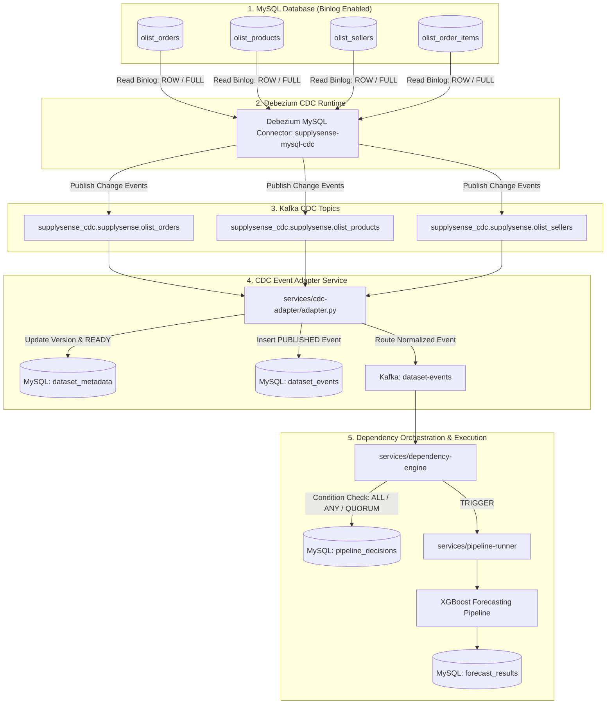

# SupplySense AI - Phase 7: Automatic Data Change Detection with Debezium CDC

## Executive Summary
Phase 7 adds **Change Data Capture (CDC)** capabilities to SupplySense AI using **Debezium Connect** and **MySQL Binary Logging (binlog)**. Changes made to relational database tables are captured automatically at the transaction log level, routed through Kafka, normalized by the **CDC Event Adapter**, and fed into the Dependency Orchestration and Demand Forecasting engines without requiring manual simulation scripts.

---

## Architecture



---

## MySQL CDC & Docker Infrastructure

### MySQL Binlog Configuration
- `log_bin = ON`
- `binlog_format = ROW`
- `binlog_row_image = FULL`
- `server_id = 1`

### Docker Services (`docker-compose.yml`)
- **`supplysense-kafka`** (`apache/kafka:4.3.1`): Dual listeners for host Python services (`localhost:9092`) and Docker internal networking (`kafka:29092`).
- **`supplysense-debezium`** (`debezium/connect:2.7.3.Final`): Exposes REST API on port `8083` and captures binlog changes.

---

## Connector Configuration

Defined in `services/cdc-adapter/connector_config.json`:

```json
{
  "name": "supplysense-mysql-cdc",
  "config": {
    "connector.class": "io.debezium.connector.mysql.MySqlConnector",
    "tasks.max": "1",
    "database.hostname": "host.docker.internal",
    "database.port": "3306",
    "database.user": "root",
    "database.password": "root",
    "database.server.id": "184054",
    "topic.prefix": "supplysense_cdc",
    "database.include.list": "supplysense",
    "table.include.list": "supplysense.olist_orders,supplysense.olist_products,supplysense.olist_sellers,supplysense.olist_order_items",
    "schema.history.internal.kafka.bootstrap.servers": "kafka:29092",
    "schema.history.internal.kafka.topic": "schema-changes.supplysense",
    "snapshot.mode": "schema_only",
    "key.converter": "org.apache.kafka.connect.json.JsonConverter",
    "key.converter.schemas.enable": "false",
    "value.converter": "org.apache.kafka.connect.json.JsonConverter",
    "value.converter.schemas.enable": "false",
    "include.schema.changes": "false"
  }
}
```

---

## CDC Normalization & Event Mapping

| MySQL Table | SupplySense Dataset Name | Dataset ID | Captured Operations |
|---|---|---|---|
| `olist_orders` | `Orders` | `1` | Insert (`c`), Update (`u`), Delete (`d`) |
| `olist_order_items` | `Order Items` | `2` | Insert (`c`), Update (`u`), Delete (`d`) |
| `olist_products` | `Products` | `3` | Insert (`c`), Update (`u`), Delete (`d`) |
| `olist_sellers` | `Sellers` | `4` | Insert (`c`), Update (`u`), Delete (`d`) |

---

## Verification & Tests

```powershell
.\.venv\Scripts\python.exe -m unittest discover -s tests -v
```

* **Unit Tests**: [`tests/unit/test_cdc_adapter.py`](file:///c:/Users/varun%20sai/PycharmProjects/PythonProject/capstone/tests/unit/test_cdc_adapter.py) (10 tests)
* **Integration Tests**: [`tests/integration/test_phase7_cdc_flow.py`](file:///c:/Users/varun%20sai/PycharmProjects/PythonProject/capstone/tests/integration/test_phase7_cdc_flow.py) (3 tests)
* **End-to-End Demo**: [`scripts/demo_phase7_cdc.py`](file:///c:/Users/varun%20sai/PycharmProjects/PythonProject/capstone/scripts/demo_phase7_cdc.py)
* **Total Test Suite**: **100/100 tests passing**.
